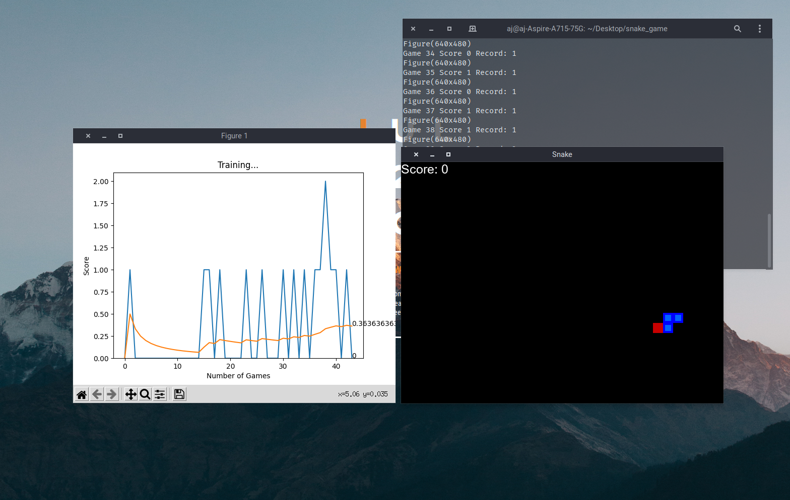
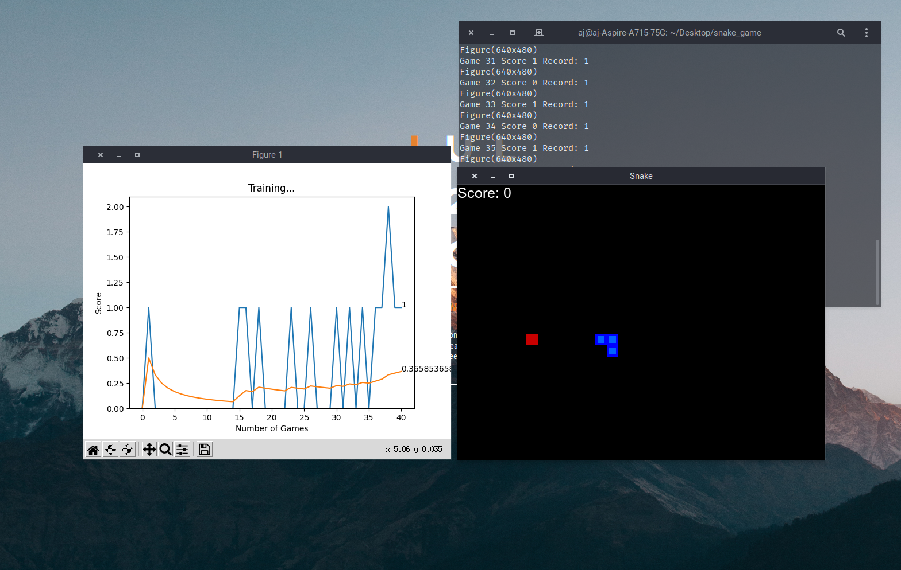

# Reinforcement-SnakeGame
Python snake game which learns through reinforcement learning to play made with pygame and pytorch.

This project takes the traditional Snake game to the next level by implementing an AI agent that learns to play the game through trial and error. Using the Pygame library, we've crafted an immersive and interactive gameplay environment that captures the essence of the original Snake game.

Powered by PyTorch's reinforcement learning algorithms, our AI agent progressively improves its performance, adapting and strategizing to achieve the highest scores possible. Watch as the SnakeAI evolves from a novice player to a skilled expert, demonstrating the fascinating capabilities of AI in gaming.

